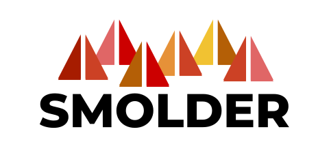

<p align="center">
  
</p>

<p align="center">
  A library for burning through electronic health record data using Apache Spark&trade;
</p>

Smolder provides an Apache Spark&trade; SQL data source for loading EHR data from
[HL7v2](https://www.hl7.org/implement/standards/product_brief.cfm?product_id=244)
message formats. Additionally, Smolder provides helper functions that can be used
on a Spark SQL DataFrame to parse HL7 message text, and to extract segments,
fields, and subfields, from a message.


# Project Support
Please note that all projects in the /databrickslabs github account are provided for your exploration only, and are not formally supported by Databricks with Service Level Agreements (SLAs).  They are provided AS-IS and we do not make any guarantees of any kind.  Please do not submit a support ticket relating to any issues arising from the use of these projects.

Any issues discovered through the use of this project should be filed as GitHub Issues on the Repo.  They will be reviewed as time permits, but there are no formal SLAs for support.

# Building and Testing

This project is built using [sbt](https://www.scala-sbt.org/1.0/docs/Setup.html) and Java 8.

Start an sbt shell using the `sbt` command.

> **FYI**: The following SBT projects are built on Spark 3.0.0/Scala 2.12.8 by default. To change the Spark version and
Scala version, set the environment variables `SPARK_VERSION` and `SCALA_VERSION`.

To compile the main code:
```
compile
```

To run all Scala tests:
```
test
```

To test a specific suite:
```
testOnly *HL7FileFormatSuite
```

To create a JAR that can be run as part of an [Apache Spark job or
shell](http://spark.apache.org/docs/latest/submitting-applications.html#advanced-dependency-management), run:
```
package
```

The JAR can be found under `target/scala-<major-version>`.

# Getting Started

To load HL7 messages into an [Apache Spark SQL
DataFrame](http://spark.apache.org/docs/latest/sql-programming-guide.html),
simply invoke the `hl7` reader:

```
scala> val df = spark.read.format("hl7").load("path/to/hl7/messages")
df: org.apache.spark.sql.DataFrame = [message: string, segments: array<struct<id:string,fields:array<string>>>]
```

The schema returned contains the message header in the `message` column. The
message segments are nested in the `segments` column, which is an array. This
array contains two nested fields: the string `id` for the segment (e.g., `PID`
for a [patient identification segment](http://www.hl7.eu/refactored/segPID.html)
and an array of segment `fields`.

## Parsing message text from a DataFrame

Smolder can also be used to parse raw message text. This might happen if you had
an HL7 message feed land in an intermediate source first (e.g., a Kafka stream).
To do this, we can use Smolder's `parse_hl7_message` helper function. First, we
start with a DataFrame containing HL7 message text:

```
scala> val textMessageDf = ...
textMessageDf: org.apache.spark.sql.DataFrame = [value: string]

scala> textMessageDf.show()
+--------------------+                                                          
|               value|
+--------------------+
|MSH|^~\&|||||2020...|
+--------------------+
```

Then, we can import the `parse_hl7_message` message from the
`com.databricks.labs.smolder.functions` object and apply that to the column we
want to parse:

```
scala> import com.databricks.labs.smolder.functions.parse_hl7_message
import com.databricks.labs.smolder.functions.parse_hl7_message

scala> val parsedDf = textMessageDf.select(parse_hl7_message($"value").as("message"))
parsedDf: org.apache.spark.sql.DataFrame = [message: struct<message: string, segments: array<struct<id:string,fields:array<string>>>>]
```

This yields the same schema as our `hl7` data source.

## Integration with Pyspark
In order run Scala code with pyspark we must compile the smolder jar and pass it to our cluster. From there, we can do the following:
```
# Python
from pyspark.sql.column import Column
df = <some pyspark dataframe>
jvm = sc._jvm
ssqlContext = sqlContext._ssql_ctx
jdf = df._jdf

# Access the functions class 
f = jvm.com.databricks.labs.smolder.functions(ssqlContext, jdf)
result = df.select(Column(f.parse_hl7_message(jdf.col("value"))).alias("message"))
```

## Extracting fields from an HL7 message segment

While Smolder provides an easy-to-use schema for HL7 messages, we also provide
helper functions in `com.databricks.labs.smolder.functions` to extract subfields
of a message segment. For instance, let's say we want to get the patient's name,
which is the 5th field in the patient ID (PID) segment. We can extract this with
the `segment_field` function:

```
scala> import com.databricks.labs.smolder.functions.segment_field
import com.databricks.labs.smolder.functions.segment_field

scala> val nameDf = df.select(segment_field("PID", 4).alias("name"))
nameDf: org.apache.spark.sql.DataFrame = [name: string]

scala> nameDf.show()
+-------------+
|         name|
+-------------+
|Heller^Keneth|
+-------------+
```

If we then wanted to get the patient's first name, we can use the `subfield`
function:

```
scala> import com.databricks.labs.smolder.functions.subfield
import com.databricks.labs.smolder.functions.subfield

scala> val firstNameDf = nameDf.select(subfield($"name", 1).alias("firstname"))
firstNameDf: org.apache.spark.sql.DataFrame = [firstname: string]

scala> firstNameDf.show()
+---------+
|firstname|
+---------+
|   Keneth|
+---------+
```

# License and Contributing

Smolder is made available under an [Apache 2.0 license](LICENSE), and we welcome
contributions from the community. Please see our [contibutor guidance](CONTRIBUTING.md)
for information about how to contribute to the project. To ensure that contributions
to Smolder are properly licensed, we follow the [Developer Certificate of Origin
(DCO)](http://developercertificate.org/) for all contributions to the project.